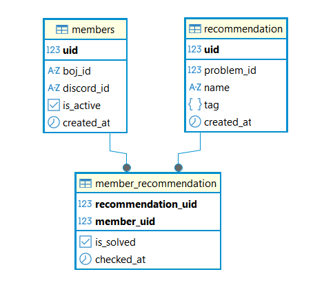

<div align=center>
  <h1>omunchu</h1>
  <p>BOJ 문제 추천 자동화 시스템</p>
  <p>
  
  
  
  </p>
  <p>Latest: v1.1 | <a href="#-릴리즈-노트">릴리즈 노트</a></p>
  <p></p>
</div>

---

## 📌 프로젝트 소개

omunchu는 **BOJ(백준) 문제를 자동으로 추천해주는 서비스**입니다.  
스터디원들의 실력을 기반으로 난이도를 조정하고  
아직 풀지 않은 문제 중에서 적절한 문제를 추천합니다.

또한 일정 시간 이후에도 문제를 풀지 않은 경우 리마인드 알림을 제공합니다.

---

## 🎯 핵심 기능

### 1. 📊 티어 기반 문제 추천
- 팀원들의 평균 티어를 기반으로 문제 난이도 설정
- 추천 범위: 평균 티어 ~ 평균티어-2

### 2. 🎲 랜덤 추천 및 조건 필터링
- 조건:
  - 정답자 수 ≥ 1000
  - 한국어 문제
  - 추천 기록이 없는 문제
- 조건에 맞는 문제가 없을 경우 조건 완화 후 재시도

### 3. 🔔 Discord 알림
- 매일 추천 문제 전송
- 미해결 시 멘션 기반 리마인드

---

## ⚙️ 기술 스택

- **Workflow**: n8n (Self-hosted)
- **Database**: PostgreSQL
- **Infra**: Docker, Docker Compose
- **External API**: solvedac API
- **Notification**: Discord Webhook

---

## 🗄️ 데이터베이스 설계


---

## 🚀 실행 방법

```bash
docker compose up -d
```

---

## 🔐 환경 변수 (.env)

```env
# POSTGRESQL
POSTGRES_DB=
POSTGRES_USER=
POSTGRES_PASSWORD=

# N8N
N8N_USER=
N8N_PASSWORD=
N8N_ENCRYPTION_KEY=

# DISCORD
DISCORD_WEBHOOK_RECOMMENDATION_URL=
DISCORD_WEBHOOK_REMINDER_URL=
```

---

## 📦 릴리즈 노트
### v1.1
- 인증 쿠키 설정 문제 수정 (secure 옵션 조정)
- solved.ac API 요청 안정정 개선

### v1.0
- 문제 추천 자동화 워크플로우 구축
- 디스코드 알림 기능 구현
- PostgreSQL 기반 데이터 구조 설계